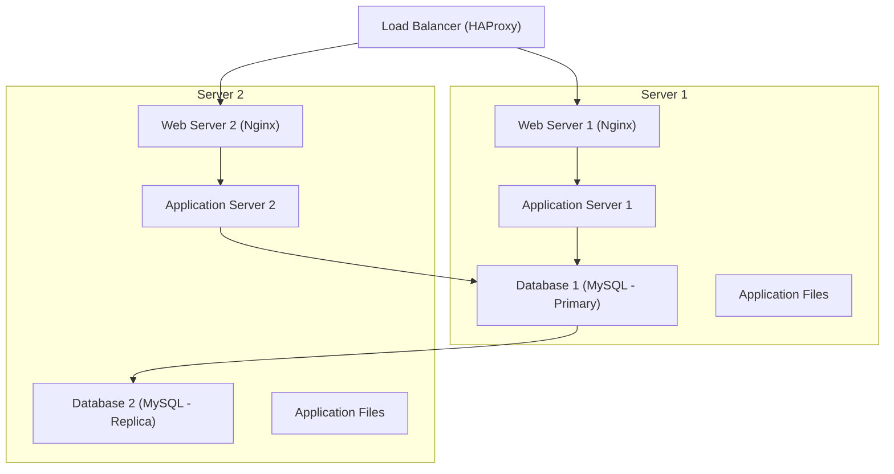

# Distributed Web Infrastructure for www.foobar.com

## Infrastructure Diagram  


## Components

1. **Load Balancer (HAProxy)**
   - Distributes traffic across two servers using **Round Robin**:
     ```
     ┌──── request1: --> Server 1
     ├──── request2: --> Server 2
     ├──── request3: --> Server 1
     ├──── request4: --> Server 2
     ```
   - Configured in **Active-Active** mode: both servers handle requests simultaneously.

2. **Two Servers**
   - **Web Servers (Nginx)**: Serve static files and proxy requests to the application.
   - **Application Servers**: Process logic and serve dynamic content.

3. **Database Cluster**
   - **Primary Database**: Handles write operations (Insert, Update, Delete).
   - **Replica Database**: Handles read operations (Select), reducing the Primary's load.

## Issues

1. **Single Points of Failure (SPOF)**
   - Load Balancer failure stops traffic distribution.
   - Primary Database crash limits functionality to read-only.

2. **Security**
   - No firewall: Vulnerable to attacks.
   - No HTTPS: Exposes unencrypted traffic.

3. **No Monitoring**
   - Lack of tools for performance tracking and failure detection.
