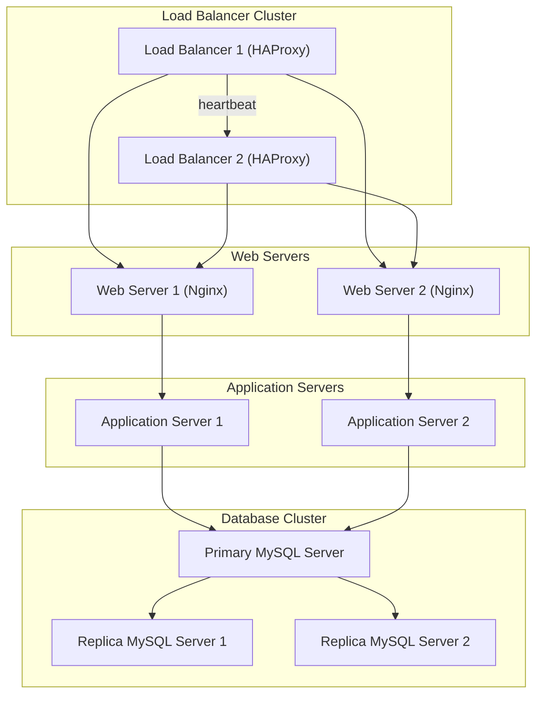

# Secure Web Infrastructure for www.foobar.com

## Components Added

1. **Firewalls**
   - **Purpose**: Protect each server by filtering unauthorized access.
   - **Placement**: One firewall for each server (Web, Application, Database).

2. **SSL Certificate**
   - **Purpose**: Encrypt user-server communication for security.
   - **Implementation**: Terminate SSL at the Load Balancer to reduce overhead on servers.

3. **Monitoring Clients**
   - **Purpose**: Collect performance data and monitor server health.
   - **Implementation**: Use tools like Sumologic to track CPU, memory, and queries.
   - **Example**: Measure Web Server Queries Per Second (QPS) for traffic analysis.

## Infrastructure Design

### Traffic Flow

1. **Load Balancer**
   - Balances incoming requests using a Round Robin algorithm.
   - Terminates SSL to decrypt traffic and forward it internally.

2. **Servers**
   - **Web Servers (Nginx)**: Serve static files and forward dynamic requests.
   - **Application Servers**: Handle application logic and database requests.

3. **Database Cluster**
   - **Primary**: Handles all write operations.
   - **Replica**: Handles read operations to balance load and ensure redundancy.

## Identified Issues

1. **Unencrypted Internal Traffic**
   - SSL termination at the Load Balancer leaves backend traffic exposed.

2. **Single Point of Failure: Database Write Server**
   - If the Primary server fails, write operations halt.

3. **Non-Dedicated Server Roles**
   - Combining Web, Application, and Database functions on one server creates resource conflicts.

4. **Monitoring Coverage**
   - Without proactive monitoring, failures may go undetected.

## Recommendations

1. Extend SSL encryption to backend traffic to secure internal communication.
2. Add a failover mechanism for the Primary Database to prevent write disruptions.
3. Separate server roles to improve specialization and avoid resource contention.
4. Integrate proactive monitoring tools like Prometheus and Grafana for better visibility.

