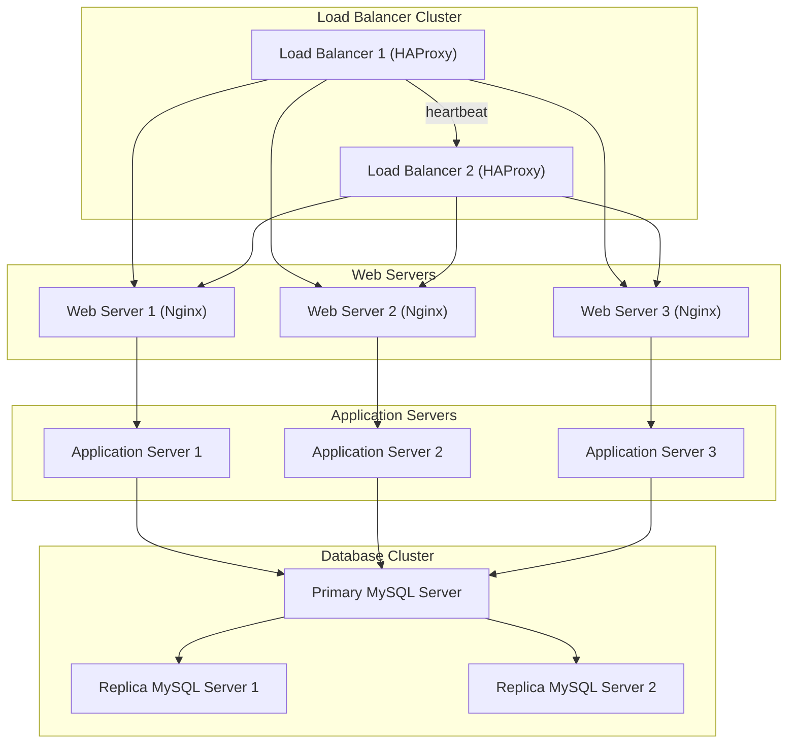

# Application Server vs Web Server Infrastructure

## Components Added

1. **New Server**
   - **Purpose**: Hosts the Application Server for executing business logic separately from the Web Server.
   - **Justification**: Separating roles improves performance and scalability.

2. **Load Balancer (HAProxy)**
   - **Purpose**: Configured as a cluster with the existing Load Balancer to enhance redundancy and availability.
   - **Justification**: Prevents downtime and evenly distributes traffic.

3. **Split Components**
   - **Web Server**:
     - Runs Nginx to serve static content and forward requests to the Application Server.
   - **Application Server**:
     - Processes dynamic requests and interacts with the Database Server.
   - **Database Server**:
     - Handles data storage and ensures separation from Web and Application logic.

## Infrastructure Design

### Updated Traffic Flow

1. **Load Balancers**
   - Operate as a cluster using Active-Active configuration for high availability.
   - Distribute traffic between the Web Servers.

2. **Servers**
   - **Web Servers (Nginx)**:
     - Serve static files and route requests to Application Servers.
   - **Application Servers**:
     - Execute business logic and interact with the database.
   - **Database Server**:
     - Stores data, handles queries, and ensures data integrity.

## Why Split Components?

1. **Web Server**:
   - Dedicated to serving static content quickly.
   - Reduces resource contention with Application logic.

2. **Application Server**:
   - Processes business logic and dynamic requests.
   - Allows independent scaling for high traffic scenarios.

3. **Database Server**:
   - Ensures data consistency and security.
   - Separation reduces risk of resource overload.

## Advantages of This Infrastructure

1. **Performance**:
   - Specialized roles for each server improve efficiency and reduce bottlenecks.

2. **Scalability**:
   - Each component can be scaled independently based on demand.

3. **Redundancy**:
   - Load Balancer clustering prevents downtime.

## Architecture Overview

## Recommendations

1. Monitor inter-server communication to identify bottlenecks.
2. Implement firewalls to secure individual servers.
3. Use a monitoring tool (e.g., Prometheus) to track QPS on Web and Application Servers.
